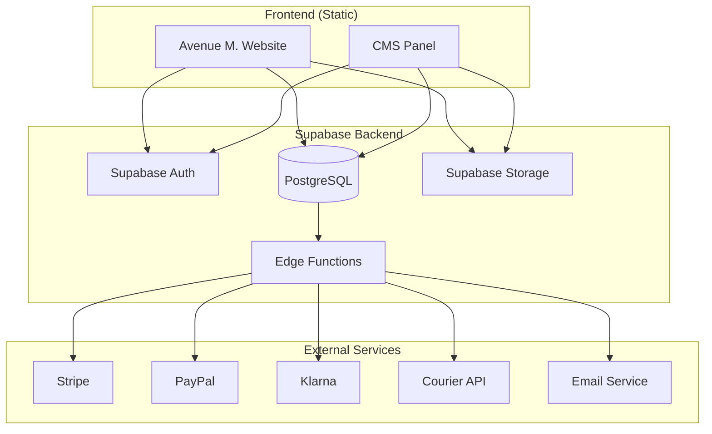

# Design Document: Avenue M. E-commerce Platform

## Overview

Questo documento descrive l'architettura e il design tecnico per la trasformazione del sito Avenue Gallarate in una piattaforma e-commerce completa. Il sistema sarà costruito su un'architettura serverless utilizzando Supabase come backend primario, con integrazioni per pagamenti (Stripe, PayPal, Klarna) e spedizioni automatizzate.

### Tech Stack

- **Frontend**: HTML5, CSS3, JavaScript (vanilla o con framework leggero)
- **Backend**: Supabase (PostgreSQL, Auth, Storage, Edge Functions)
- **Payments**: Stripe Checkout, PayPal SDK, Klarna API
- **Hosting**: Netlify/Vercel (static hosting)
- **Testing**: Vitest + fast-check (property-based testing)

## Architecture



### Data Flow

1. **Guest User Flow**: Browse → Add to Cart/Wishlist (localStorage) → Checkout → Login/Register → Sync → Payment
2. **Authenticated User Flow**: Login → Browse → Add to Cart/Wishlist (Supabase) → Checkout → Payment
3. **Admin Flow**: Login (admin) → CMS Panel → CRUD Products → Supabase DB

## Components and Interfaces

### 1. Authentication Module (`/js/auth.js`)

```typescript
interface AuthService {
  signUp(email: string, password: string, metadata: UserMetadata): Promise<AuthResponse>
  signIn(email: string, password: string): Promise<AuthResponse>
  signOut(): Promise<void>
  getSession(): Promise<Session | null>
  onAuthStateChange(callback: (event: AuthEvent, session: Session | null) => void): Subscription
}

interface UserMetadata {
  first_name: string
  last_name: string
}
```

### 2. Wishlist Service (`/js/wishlist.js`)

```typescript
interface WishlistService {
  // Guest operations (localStorage)
  getLocalWishlist(): string[]
  addToLocalWishlist(productId: string): void
  removeFromLocalWishlist(productId: string): void
  
  // Authenticated operations (Supabase)
  getWishlist(userId: string): Promise<WishlistItem[]>
  addToWishlist(userId: string, productId: string): Promise<void>
  removeFromWishlist(userId: string, productId: string): Promise<void>
  
  // Sync operations
  migrateLocalToSupabase(userId: string): Promise<void>
  mergeWishlists(userId: string): Promise<void>
}

interface WishlistItem {
  id: string
  user_id: string
  product_id: string
  created_at: string
}
```

### 3. Cart Service (`/js/cart.js`)

```typescript
interface CartService {
  getCart(userId?: string): Promise<CartItem[]>
  addToCart(item: CartItemInput): Promise<void>
  updateQuantity(itemId: string, quantity: number): Promise<void>
  removeFromCart(itemId: string): Promise<void>
  getCartTotal(): Promise<CartTotal>
  clearCart(): Promise<void>
}

interface CartItem {
  id: string
  product_id: string
  product: Product
  size: string
  color: string
  quantity: number
  unit_price: number
}

interface CartTotal {
  subtotal: number
  discount: number
  shipping: number
  total: number
}
```

### 4. Payment Gateway (`/js/payment.js`)

```typescript
interface PaymentGateway {
  createStripeSession(cart: CartItem[], customerId?: string): Promise<StripeSession>
  createPayPalOrder(cart: CartItem[]): Promise<PayPalOrder>
  createKlarnaSession(cart: CartItem[]): Promise<KlarnaSession>
  handlePaymentSuccess(sessionId: string, provider: PaymentProvider): Promise<Order>
  applyGiftCard(code: string, total: number): Promise<GiftCardResult>
}

type PaymentProvider = 'stripe' | 'paypal' | 'klarna'
```

### 5. Order Management (`/js/orders.js`)

```typescript
interface OrderService {
  createOrder(paymentResult: PaymentResult, cart: CartItem[]): Promise<Order>
  getOrderHistory(userId: string): Promise<Order[]>
  getOrderById(orderId: string): Promise<Order>
  updateOrderStatus(orderId: string, status: OrderStatus): Promise<void>
  submitToCourier(order: Order): Promise<CourierResponse>
}

type OrderStatus = 'pending' | 'confirmed' | 'processing' | 'shipped' | 'delivered' | 'cancelled'

interface Order {
  id: string
  user_id: string
  status: OrderStatus
  items: OrderItem[]
  total: number
  shipping_address: Address
  tracking_number?: string
  tracking_url?: string
  created_at: string
}
```

### 6. Product Catalog (`/js/products.js`)

```typescript
interface ProductService {
  getProducts(filters?: ProductFilters): Promise<Product[]>
  getProductById(id: string): Promise<Product>
  getCategories(): Promise<Category[]>
  searchProducts(query: string): Promise<Product[]>
}

interface ProductFilters {
  category_id?: string
  gender?: 'man' | 'woman' | 'unisex'
  price_min?: number
  price_max?: number
  is_promotion?: boolean
  sort_by?: 'price_asc' | 'price_desc' | 'newest' | 'popular'
}

interface Product {
  id: string
  name: string
  description: string
  price: number
  sale_price?: number
  category_id: string
  gender: string
  images: string[]
  sizes: string[]
  colors: string[]
  inventory: number
  is_active: boolean
  created_at: string
}
```

### 7. CMS Panel (`/admin/`)

```typescript
interface CMSService {
  // Products
  createProduct(product: ProductInput): Promise<Product>
  updateProduct(id: string, updates: Partial<ProductInput>): Promise<Product>
  deleteProduct(id: string): Promise<void> // soft delete
  
  // Categories
  createCategory(category: CategoryInput): Promise<Category>
  updateCategory(id: string, updates: Partial<CategoryInput>): Promise<Category>
  
  // Promotions
  createPromotion(promo: PromotionInput): Promise<Promotion>
  updatePromotion(id: string, updates: Partial<PromotionInput>): Promise<Promotion>
  deactivatePromotion(id: string): Promise<void>
  
  // Images
  uploadImage(file: File, path: string): Promise<string>
  deleteImage(path: string): Promise<void>
}
```

### 8. Gift Card Service (`/js/giftcard.js`)

```typescript
interface GiftCardService {
  createGiftCard(config: GiftCardConfig): GiftCardPreview
  purchaseGiftCard(config: GiftCardConfig): Promise<GiftCard>
  validateCode(code: string): Promise<GiftCardValidation>
  redeemGiftCard(code: string, amount: number): Promise<RedemptionResult>
}

interface GiftCardConfig {
  template_id: string
  amount: number
  recipient_name: string
  recipient_email: string
  sender_name: string
  message: string
}

interface GiftCard {
  id: string
  code: string
  amount: number
  balance: number
  recipient_email: string
  is_redeemed: boolean
  created_at: string
  expires_at: string
}
```

## Data Models

### Database Schema (Supabase PostgreSQL)

```sql
-- Users (managed by Supabase Auth, extended with profiles)
CREATE TABLE profiles (
  id UUID PRIMARY KEY REFERENCES auth.users(id) ON DELETE CASCADE,
  first_name TEXT NOT NULL,
  last_name TEXT NOT NULL,
  phone TEXT,
  created_at TIMESTAMPTZ DEFAULT NOW(),
  updated_at TIMESTAMPTZ DEFAULT NOW()
);

-- User Roles for Admin Access
CREATE TABLE user_roles (
  id UUID PRIMARY KEY DEFAULT gen_random_uuid(),
  user_id UUID REFERENCES auth.users(id) ON DELETE CASCADE,
  role TEXT NOT NULL CHECK (role IN ('customer', 'admin')),
  created_at TIMESTAMPTZ DEFAULT NOW(),
  UNIQUE(user_id, role)
);

-- Categories
CREATE TABLE categories (
  id UUID PRIMARY KEY DEFAULT gen_random_uuid(),
  name TEXT NOT NULL,
  slug TEXT UNIQUE NOT NULL,
  description TEXT,
  parent_id UUID REFERENCES categories(id),
  image_url TEXT,
  is_active BOOLEAN DEFAULT true,
  created_at TIMESTAMPTZ DEFAULT NOW()
);

-- Products
CREATE TABLE products (
  id UUID PRIMARY KEY DEFAULT gen_random_uuid(),
  name TEXT NOT NULL,
  slug TEXT UNIQUE NOT NULL,
  description TEXT,
  price DECIMAL(10,2) NOT NULL,
  sale_price DECIMAL(10,2),
  category_id UUID REFERENCES categories(id),
  gender TEXT CHECK (gender IN ('man', 'woman', 'unisex')),
  images TEXT[] DEFAULT '{}',
  sizes TEXT[] DEFAULT '{}',
  colors TEXT[] DEFAULT '{}',
  inventory INTEGER DEFAULT 0,
  is_active BOOLEAN DEFAULT true,
  is_featured BOOLEAN DEFAULT false,
  created_at TIMESTAMPTZ DEFAULT NOW(),
  updated_at TIMESTAMPTZ DEFAULT NOW()
);

-- Indexes for filtering performance
CREATE INDEX idx_products_category ON products(category_id);
CREATE INDEX idx_products_price ON products(price);
CREATE INDEX idx_products_gender ON products(gender);
CREATE INDEX idx_products_active ON products(is_active);
CREATE INDEX idx_products_composite ON products(category_id, price, gender, is_active);

-- Wishlist Items
CREATE TABLE wishlist_items (
  id UUID PRIMARY KEY DEFAULT gen_random_uuid(),
  user_id UUID REFERENCES auth.users(id) ON DELETE CASCADE,
  product_id UUID REFERENCES products(id) ON DELETE CASCADE,
  created_at TIMESTAMPTZ DEFAULT NOW(),
  UNIQUE(user_id, product_id)
);

-- Cart Items
CREATE TABLE cart_items (
  id UUID PRIMARY KEY DEFAULT gen_random_uuid(),
  user_id UUID REFERENCES auth.users(id) ON DELETE CASCADE,
  product_id UUID REFERENCES products(id) ON DELETE CASCADE,
  size TEXT NOT NULL,
  color TEXT NOT NULL,
  quantity INTEGER NOT NULL DEFAULT 1 CHECK (quantity > 0),
  created_at TIMESTAMPTZ DEFAULT NOW(),
  updated_at TIMESTAMPTZ DEFAULT NOW()
);

-- Orders
CREATE TABLE orders (
  id UUID PRIMARY KEY DEFAULT gen_random_uuid(),
  user_id UUID REFERENCES auth.users(id),
  status TEXT NOT NULL DEFAULT 'pending' CHECK (status IN ('pending', 'confirmed', 'processing', 'shipped', 'delivered', 'cancelled')),
  subtotal DECIMAL(10,2) NOT NULL,
  discount DECIMAL(10,2) DEFAULT 0,
  shipping_cost DECIMAL(10,2) DEFAULT 0,
  total DECIMAL(10,2) NOT NULL,
  shipping_address JSONB NOT NULL,
  billing_address JSONB,
  payment_provider TEXT,
  payment_id TEXT,
  tracking_number TEXT,
  tracking_url TEXT,
  notes TEXT,
  created_at TIMESTAMPTZ DEFAULT NOW(),
  updated_at TIMESTAMPTZ DEFAULT NOW()
);

-- Order Items
CREATE TABLE order_items (
  id UUID PRIMARY KEY DEFAULT gen_random_uuid(),
  order_id UUID REFERENCES orders(id) ON DELETE CASCADE,
  product_id UUID REFERENCES products(id),
  product_name TEXT NOT NULL, -- Snapshot at time of order
  product_price DECIMAL(10,2) NOT NULL,
  size TEXT NOT NULL,
  color TEXT NOT NULL,
  quantity INTEGER NOT NULL,
  created_at TIMESTAMPTZ DEFAULT NOW()
);

-- Promotions
CREATE TABLE promotions (
  id UUID PRIMARY KEY DEFAULT gen_random_uuid(),
  name TEXT NOT NULL,
  description TEXT,
  discount_type TEXT CHECK (discount_type IN ('percentage', 'fixed')),
  discount_value DECIMAL(10,2) NOT NULL,
  min_purchase DECIMAL(10,2) DEFAULT 0,
  code TEXT UNIQUE,
  starts_at TIMESTAMPTZ NOT NULL,
  ends_at TIMESTAMPTZ NOT NULL,
  is_active BOOLEAN DEFAULT true,
  created_at TIMESTAMPTZ DEFAULT NOW()
);

-- Gift Cards
CREATE TABLE gift_cards (
  id UUID PRIMARY KEY DEFAULT gen_random_uuid(),
  code TEXT UNIQUE NOT NULL,
  amount DECIMAL(10,2) NOT NULL,
  balance DECIMAL(10,2) NOT NULL,
  template_id TEXT,
  recipient_name TEXT,
  recipient_email TEXT,
  sender_name TEXT,
  message TEXT,
  purchased_by UUID REFERENCES auth.users(id),
  is_active BOOLEAN DEFAULT true,
  created_at TIMESTAMPTZ DEFAULT NOW(),
  expires_at TIMESTAMPTZ,
  redeemed_at TIMESTAMPTZ
);

-- Audit Log
CREATE TABLE audit_log (
  id UUID PRIMARY KEY DEFAULT gen_random_uuid(),
  user_id UUID REFERENCES auth.users(id),
  action TEXT NOT NULL,
  table_name TEXT NOT NULL,
  record_id UUID,
  old_data JSONB,
  new_data JSONB,
  ip_address INET,
  created_at TIMESTAMPTZ DEFAULT NOW()
);
```

### Row Level Security Policies

```sql
-- Profiles: Users can only read/update their own profile
ALTER TABLE profiles ENABLE ROW LEVEL SECURITY;

CREATE POLICY "Users can view own profile" ON profiles
  FOR SELECT USING (auth.uid() = id);

CREATE POLICY "Users can update own profile" ON profiles
  FOR UPDATE USING (auth.uid() = id);

-- Products: Anyone can read active products, only admins can modify
ALTER TABLE products ENABLE ROW LEVEL SECURITY;

CREATE POLICY "Anyone can view active products" ON products
  FOR SELECT USING (is_active = true);

CREATE POLICY "Admins can manage products" ON products
  FOR ALL USING (
    EXISTS (SELECT 1 FROM user_roles WHERE user_id = auth.uid() AND role = 'admin')
  );

-- Wishlist: Users can only access their own wishlist
ALTER TABLE wishlist_items ENABLE ROW LEVEL SECURITY;

CREATE POLICY "Users can manage own wishlist" ON wishlist_items
  FOR ALL USING (auth.uid() = user_id);

-- Cart: Users can only access their own cart
ALTER TABLE cart_items ENABLE ROW LEVEL SECURITY;

CREATE POLICY "Users can manage own cart" ON cart_items
  FOR ALL USING (auth.uid() = user_id);

-- Orders: Users can view their own orders, admins can view all
ALTER TABLE orders ENABLE ROW LEVEL SECURITY;

CREATE POLICY "Users can view own orders" ON orders
  FOR SELECT USING (auth.uid() = user_id);

CREATE POLICY "Admins can manage all orders" ON orders
  FOR ALL USING (
    EXISTS (SELECT 1 FROM user_roles WHERE user_id = auth.uid() AND role = 'admin')
  );

-- Gift Cards: Users can view their purchased cards
ALTER TABLE gift_cards ENABLE ROW LEVEL SECURITY;

CREATE POLICY "Users can view own gift cards" ON gift_cards
  FOR SELECT USING (auth.uid() = purchased_by);

CREATE POLICY "Admins can manage gift cards" ON gift_cards
  FOR ALL USING (
    EXISTS (SELECT 1 FROM user_roles WHERE user_id = auth.uid() AND role = 'admin')
  );
```


## Correctness Properties

*A property is a characteristic or behavior that should hold true across all valid executions of a system-essentially, a formal statement about what the system should do. Properties serve as the bridge between human-readable specifications and machine-verifiable correctness guarantees.*

Based on the prework analysis, the following correctness properties have been identified for property-based testing:

### Authentication Properties

**Property 1: Login error message consistency**
*For any* combination of invalid credentials (wrong email, wrong password, or both), the error message returned SHALL be identical ("Email o password non corretti"), preventing user enumeration attacks.
**Validates: Requirements 1.4**

**Property 2: Session validity after login**
*For any* valid user credentials, after successful login the session SHALL contain a valid user ID and access token.
**Validates: Requirements 1.3**

**Property 3: Session invalidation on logout**
*For any* authenticated session, after logout the session SHALL be null and subsequent authenticated requests SHALL fail.
**Validates: Requirements 1.5**

**Property 4: Rate limiting enforcement**
*For any* IP address, after 5 failed login attempts within 15 minutes, subsequent login attempts SHALL be rejected regardless of credential validity.
**Validates: Requirements 1.7**

### Wishlist Properties

**Property 5: Guest wishlist localStorage persistence**
*For any* product ID added to wishlist by a guest user, the product ID SHALL be retrievable from localStorage.
**Validates: Requirements 2.1**

**Property 6: Authenticated wishlist Supabase persistence**
*For any* product ID added to wishlist by an authenticated user, the product ID SHALL be retrievable from the Supabase wishlist_items table for that user.
**Validates: Requirements 2.2**

**Property 7: Wishlist migration completeness**
*For any* set of product IDs in localStorage, after user registration all product IDs SHALL exist in the user's Supabase wishlist.
**Validates: Requirements 2.3**

**Property 8: Wishlist merge deduplication**
*For any* set A of product IDs in localStorage and set B of product IDs in Supabase, after merge the resulting wishlist SHALL equal the union of A and B with no duplicate entries.
**Validates: Requirements 2.4, 2.6**

### Cart Properties

**Property 9: Cart item storage integrity**
*For any* product added to cart with size S, color C, and quantity Q, the stored cart item SHALL contain exactly those values.
**Validates: Requirements 3.1**

**Property 10: Cart total invariant**
*For any* cart state, the cart total SHALL equal the sum of (unit_price × quantity) for all items, minus any applicable discounts, plus shipping.
**Validates: Requirements 3.2, 3.3**

**Property 11: Cart cross-device synchronization**
*For any* authenticated user's cart modified on device A, the same cart state SHALL be retrievable from device B after sync.
**Validates: Requirements 3.4**

### Payment Properties

**Property 12: Order creation on payment success**
*For any* successful payment transaction, an order record SHALL be created with status "confirmed" and correct total amount.
**Validates: Requirements 4.4**

**Property 13: No sensitive payment data storage**
*For any* completed payment, the orders table SHALL NOT contain credit card numbers, CVV, or full card details.
**Validates: Requirements 4.6**

### Order Management Properties

**Property 14: Courier API integration**
*For any* confirmed order, the courier API SHALL be called with order details, and the response (success or error) SHALL be recorded in the order.
**Validates: Requirements 5.1, 5.2, 5.3**

**Property 15: Order history completeness**
*For any* authenticated user, the order history SHALL contain all orders placed by that user, sorted by creation date descending.
**Validates: Requirements 5.4**

### CMS Access Control Properties

**Property 16: Admin-only CMS access**
*For any* user without admin role, attempts to create, update, or delete products SHALL be rejected by RLS policies.
**Validates: Requirements 6.1, 6.6**

**Property 17: Product soft-delete preservation**
*For any* deleted product, the product record SHALL remain in the database with is_active=false, and historical order references SHALL remain valid.
**Validates: Requirements 6.4**

### Filter Properties

**Property 18: Filter correctness**
*For any* combination of filters (price range, category, gender), all returned products SHALL satisfy ALL applied filter criteria simultaneously.
**Validates: Requirements 7.1, 7.2, 7.3, 7.4**

### Promotion Properties

**Property 19: Promotion visibility by date**
*For any* promotion, it SHALL be visible only when current_date is between starts_at and ends_at AND is_active is true.
**Validates: Requirements 10.1, 10.2**

**Property 20: Promotion discount calculation**
*For any* cart containing promotional products, the discount SHALL be correctly calculated based on discount_type (percentage or fixed) and discount_value.
**Validates: Requirements 10.3**

### Gift Card Properties

**Property 21: Gift card code uniqueness**
*For any* two purchased gift cards, their redemption codes SHALL be different.
**Validates: Requirements 11.4**

**Property 22: Gift card redemption balance**
*For any* gift card with balance B applied to order with total T, if B >= T the order total becomes 0 and remaining balance is B-T; if B < T the order total becomes T-B and balance becomes 0.
**Validates: Requirements 11.5**

### Database Integrity Properties

**Property 23: Order referential integrity**
*For any* order_item, the referenced order_id SHALL exist in the orders table and product_id SHALL reference a valid product.
**Validates: Requirements 12.3**

**Property 24: User data isolation**
*For any* authenticated user, database queries SHALL return only data belonging to that user (enforced by RLS).
**Validates: Requirements 12.4**

### Security Properties

**Property 25: Input validation**
*For any* API request with malformed or invalid input data, the request SHALL be rejected with a validation error before processing.
**Validates: Requirements 13.1**

**Property 26: Error message sanitization**
*For any* database or system error, the user-facing error message SHALL NOT contain stack traces, SQL queries, or internal system details.
**Validates: Requirements 13.2**

**Property 27: Audit trail completeness**
*For any* sensitive operation (product create/update/delete, order status change, admin action), an audit log entry SHALL be created with user_id, action, and timestamp.
**Validates: Requirements 13.3**

## Error Handling

### Client-Side Error Handling

```javascript
// Centralized error handler
class ErrorHandler {
  static handle(error, context) {
    // Log to console in development
    if (process.env.NODE_ENV === 'development') {
      console.error(`[${context}]`, error);
    }
    
    // Map error codes to user-friendly messages
    const userMessage = this.getUserMessage(error);
    
    // Display to user
    this.showNotification(userMessage, 'error');
    
    // Report to monitoring (production)
    if (process.env.NODE_ENV === 'production') {
      this.reportError(error, context);
    }
  }
  
  static getUserMessage(error) {
    const messages = {
      'auth/invalid-credentials': 'Email o password non corretti',
      'auth/email-already-exists': 'Questa email è già registrata',
      'auth/rate-limit': 'Troppi tentativi. Riprova tra qualche minuto.',
      'cart/out-of-stock': 'Prodotto non disponibile nella quantità richiesta',
      'payment/failed': 'Pagamento non riuscito. Verifica i dati e riprova.',
      'network/offline': 'Connessione assente. Verifica la tua connessione internet.',
      'default': 'Si è verificato un errore. Riprova più tardi.'
    };
    
    return messages[error.code] || messages['default'];
  }
}
```

### Server-Side Error Handling (Edge Functions)

```typescript
// Supabase Edge Function error wrapper
export function withErrorHandling(handler: Function) {
  return async (req: Request) => {
    try {
      return await handler(req);
    } catch (error) {
      // Log full error server-side
      console.error('Edge Function Error:', {
        message: error.message,
        stack: error.stack,
        timestamp: new Date().toISOString()
      });
      
      // Return sanitized error to client
      return new Response(
        JSON.stringify({
          error: 'Si è verificato un errore. Riprova più tardi.',
          code: 'INTERNAL_ERROR'
        }),
        { status: 500, headers: { 'Content-Type': 'application/json' } }
      );
    }
  };
}
```

## Testing Strategy

### Dual Testing Approach

This project employs both unit testing and property-based testing for comprehensive coverage:

1. **Unit Tests**: Verify specific examples, edge cases, and integration points
2. **Property-Based Tests**: Verify universal properties that should hold across all valid inputs

### Testing Framework

- **Test Runner**: Vitest
- **Property-Based Testing**: fast-check
- **Minimum Iterations**: 100 per property test

### Test Organization

```
/tests
  /unit
    auth.test.js
    cart.test.js
    wishlist.test.js
    products.test.js
    orders.test.js
    giftcard.test.js
  /properties
    auth.property.test.js
    cart.property.test.js
    wishlist.property.test.js
    filters.property.test.js
    promotions.property.test.js
    giftcard.property.test.js
  /integration
    checkout.integration.test.js
    cms.integration.test.js
```

### Property Test Annotation Format

Each property-based test MUST include a comment referencing the design document:

```javascript
// **Feature: avenue-ecommerce-platform, Property 8: Wishlist merge deduplication**
// **Validates: Requirements 2.4, 2.6**
test.prop([fc.array(fc.uuid()), fc.array(fc.uuid())])(
  'merged wishlist equals union without duplicates',
  (localItems, supabaseItems) => {
    const merged = mergeWishlists(localItems, supabaseItems);
    const expectedUnion = [...new Set([...localItems, ...supabaseItems])];
    expect(merged.sort()).toEqual(expectedUnion.sort());
  }
);
```

### Test Data Generators

```javascript
// Custom generators for domain objects
const productGenerator = fc.record({
  id: fc.uuid(),
  name: fc.string({ minLength: 1, maxLength: 100 }),
  price: fc.float({ min: 0.01, max: 10000, noNaN: true }),
  category_id: fc.uuid(),
  gender: fc.constantFrom('man', 'woman', 'unisex'),
  is_active: fc.boolean()
});

const cartItemGenerator = fc.record({
  product_id: fc.uuid(),
  size: fc.constantFrom('XS', 'S', 'M', 'L', 'XL'),
  color: fc.string({ minLength: 1, maxLength: 20 }),
  quantity: fc.integer({ min: 1, max: 10 })
});

const giftCardGenerator = fc.record({
  amount: fc.float({ min: 10, max: 500, noNaN: true }),
  recipient_name: fc.string({ minLength: 1, maxLength: 50 }),
  recipient_email: fc.emailAddress(),
  sender_name: fc.string({ minLength: 1, maxLength: 50 }),
  message: fc.string({ maxLength: 200 })
});
```

### Coverage Requirements

- Unit test coverage: minimum 80% for critical paths
- Property tests: all 27 correctness properties must have corresponding tests
- Integration tests: checkout flow, CMS operations, payment webhooks
