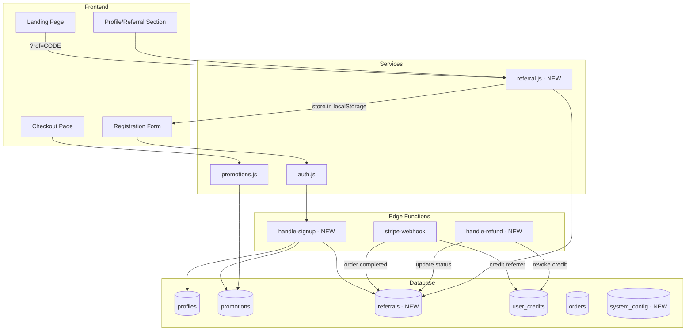

# Design Document: Sistema Codici Sconto Primo Ordine e Referral Program

## Overview

Questo documento descrive l'architettura e l'implementazione di un sistema integrato per:
1. **Codici Sconto Primo Ordine**: Generazione automatica di codici sconto alla registrazione utente
2. **Referral Program**: Sistema "invita un amico" con reward bilaterali

Il sistema si integra con l'infrastruttura esistente di Mimmo Fratelli:
- Tabella `promotions` per i codici sconto
- Tabella `user_credits` per i crediti store
- Servizio `auth.js` per la registrazione
- Webhook Stripe per il completamento ordini

## Architecture



## Components and Interfaces

### 1. Database Schema (New Tables)

#### `referrals` Table
```sql
CREATE TABLE referrals (
    id UUID PRIMARY KEY DEFAULT gen_random_uuid(),
    referrer_id UUID NOT NULL REFERENCES auth.users(id),
    referee_id UUID NOT NULL REFERENCES auth.users(id),
    referral_code VARCHAR(8) NOT NULL,
    status VARCHAR(20) DEFAULT 'pending', -- pending, converted, revoked
    reward_amount DECIMAL(10,2) DEFAULT 5.00,
    reward_credited BOOLEAN DEFAULT FALSE,
    ip_address INET,
    converted_at TIMESTAMPTZ,
    revoked_at TIMESTAMPTZ,
    created_at TIMESTAMPTZ DEFAULT NOW(),
    
    UNIQUE(referee_id),
    CONSTRAINT no_self_referral CHECK (referrer_id != referee_id)
);

CREATE INDEX idx_referrals_referrer ON referrals(referrer_id);
CREATE INDEX idx_referrals_code ON referrals(referral_code);
CREATE INDEX idx_referrals_status ON referrals(status);
```

#### `user_referral_codes` Table
```sql
CREATE TABLE user_referral_codes (
    user_id UUID PRIMARY KEY REFERENCES auth.users(id),
    code VARCHAR(8) UNIQUE NOT NULL,
    is_active BOOLEAN DEFAULT TRUE,
    total_referrals INTEGER DEFAULT 0,
    total_conversions INTEGER DEFAULT 0,
    total_earned DECIMAL(10,2) DEFAULT 0,
    created_at TIMESTAMPTZ DEFAULT NOW()
);

CREATE INDEX idx_referral_codes_code ON user_referral_codes(code);
```

#### `system_config` Table
```sql
CREATE TABLE system_config (
    key VARCHAR(100) PRIMARY KEY,
    value JSONB NOT NULL,
    updated_at TIMESTAMPTZ DEFAULT NOW(),
    updated_by UUID REFERENCES auth.users(id)
);

-- Default configuration
INSERT INTO system_config (key, value) VALUES
('first_order_discount', '{"percentage": 10, "validity_days": 30}'),
('referral_first_order_discount', '{"percentage": 15, "validity_days": 30}'),
('referral_reward', '{"amount": 5, "currency": "EUR"}'),
('referral_limits', '{"max_per_ip_daily": 3, "review_threshold": 50, "refund_window_days": 14}');
```

### 2. Frontend Services

#### `js/services/referral.js` (New)
```typescript
interface ReferralService {
    // Referral code management
    getMyReferralCode(): Promise<{code: string, stats: ReferralStats}>
    generateShareLink(): string
    
    // Referral tracking
    captureReferralFromUrl(): void
    getStoredReferralCode(): string | null
    clearStoredReferralCode(): void
    
    // Statistics
    getReferralStats(): Promise<ReferralStats>
    getReferralHistory(): Promise<Referral[]>
    
    // Share actions
    shareViaWhatsApp(): void
    shareViaEmail(): void
    copyToClipboard(): Promise<boolean>
}

interface ReferralStats {
    totalInvites: number
    conversions: number
    pendingRewards: number
    totalEarned: number
}

interface Referral {
    id: string
    refereeName: string
    status: 'pending' | 'converted' | 'revoked'
    rewardAmount: number
    createdAt: Date
    convertedAt?: Date
}
```

#### Extended `js/services/promotions.js`
```typescript
interface PromotionService {
    // Existing methods...
    
    // New methods for first-order codes
    getFirstOrderCode(userId: string): Promise<{code: string, discount: number, expiresAt: Date} | null>
    isFirstOrderCodeValid(userId: string, code: string): Promise<{valid: boolean, error?: string}>
    hasCompletedOrder(userId: string): Promise<boolean>
}
```

### 3. Edge Functions

#### `handle-signup` (New)
Triggered after user registration to:
1. Generate first-order discount code
2. Generate permanent referral code
3. Process referral relationship if applicable

#### Extended `stripe-webhook`
Additional logic to:
1. Check if order is from a referee
2. Credit referrer if first order
3. Update referral status to 'converted'

#### `handle-refund` (New or extend existing)
Logic to:
1. Check if refunded order was a referral conversion
2. Revoke referrer credit if within 14-day window
3. Update referral status to 'revoked'

### 4. UI Components

#### Profile Referral Section
- Display personal referral code
- Share buttons (WhatsApp, Email, Copy)
- Statistics dashboard
- Referral history list

#### Checkout Enhancement
- Auto-display first-order code if available
- Visual indicator for referral bonus

## Data Models

### First Order Promotion Record
```typescript
interface FirstOrderPromotion {
    id: string
    code: string                    // Format: BENVENUTO-XXXXXX
    user_id: string
    discount_type: 'percentage'
    discount_value: number          // 10 or 15 (if referral)
    is_active: boolean
    usage_count: number             // 0 or 1
    usage_limit: 1
    starts_at: Date
    ends_at: Date                   // created_at + 30 days
    is_first_order_code: boolean    // NEW flag
    referral_bonus: boolean         // NEW flag
}
```

### Referral Relationship
```typescript
interface ReferralRelationship {
    id: string
    referrer_id: string
    referee_id: string
    referral_code: string
    status: 'pending' | 'converted' | 'revoked'
    reward_amount: number
    reward_credited: boolean
    ip_address: string
    converted_at?: Date
    revoked_at?: Date
    created_at: Date
}
```

## Correctness Properties

*A property is a characteristic or behavior that should hold true across all valid executions of a system-essentially, a formal statement about what the system should do. Properties serve as the bridge between human-readable specifications and machine-verifiable correctness guarantees.*

Based on the prework analysis, the following properties must be verified:

### Property 1: First Order Code Generation
*For any* newly registered user, there SHALL exist exactly one promotion record with `is_first_order_code = true` and code prefix "BENVENUTO" associated with that user.
**Validates: Requirements 1.1**

### Property 2: First Order Code Configuration
*For any* first-order promotion code, the `discount_value` SHALL be either 10 (standard) or 15 (referral), `discount_type` SHALL be "percentage", and `ends_at` SHALL be exactly 30 days after `created_at`.
**Validates: Requirements 1.2, 3.3**

### Property 3: First Order Code Restriction
*For any* user who has at least one order with `payment_status = 'completed'`, attempting to apply their first-order code SHALL return an error and the code SHALL NOT be applied.
**Validates: Requirements 1.4**

### Property 4: Discount Calculation Excludes Shipping
*For any* cart with items and shipping cost, when a first-order percentage discount is applied, the discount amount SHALL equal `(subtotal * discount_percentage / 100)` and SHALL NOT include shipping in the calculation.
**Validates: Requirements 1.5**

### Property 5: Referral Code Format
*For any* registered user, there SHALL exist exactly one referral code of exactly 8 alphanumeric characters in the `user_referral_codes` table.
**Validates: Requirements 2.1**

### Property 6: Referral Link Format
*For any* referral code, the generated share link SHALL contain the query parameter `?ref=` followed by the exact 8-character code.
**Validates: Requirements 2.4**

### Property 7: Referral Code Persistence
*For any* visitor accessing the site with a valid `?ref=CODE` parameter, the code SHALL be stored in localStorage and retrievable until explicitly cleared or registration completes.
**Validates: Requirements 3.1**

### Property 8: Referral Relationship Creation
*For any* registration completed with a valid stored referral code, there SHALL exist exactly one row in `referrals` table linking the new user (referee) to the code owner (referrer).
**Validates: Requirements 3.2**

### Property 9: Invalid Referral Fallback
*For any* registration with an invalid or non-existent referral code, the user SHALL still be created with a standard 10% first-order code and NO referral relationship SHALL be created.
**Validates: Requirements 3.4**

### Property 10: Referral Reward Credit
*For any* referee's first completed order, the referrer's `user_credits.balance` SHALL increase by exactly the configured reward amount (default €5).
**Validates: Requirements 4.1**

### Property 11: Referral Conversion Status
*For any* referee's first completed order, the corresponding `referrals` record SHALL have `status = 'converted'`, `reward_credited = true`, and `converted_at` set to a non-null timestamp.
**Validates: Requirements 4.2**

### Property 12: Referral Statistics Accuracy
*For any* referrer, the statistics returned SHALL accurately reflect: count of `referrals` where `referrer_id` matches, count where `status = 'converted'`, and sum of `reward_amount` where `reward_credited = true`.
**Validates: Requirements 4.4**

### Property 13: Self-Referral Prevention
*For any* user attempting to register using their own referral code (same email or detected same user), NO referral relationship SHALL be created and registration SHALL proceed with standard 10% discount.
**Validates: Requirements 5.1**

### Property 14: IP Rate Limiting
*For any* IP address, within a 24-hour window, at most 3 referral conversions SHALL result in reward credits, regardless of how many registrations occur.
**Validates: Requirements 5.2**

### Property 15: Refund Credit Revocation
*For any* order refunded within 14 days that was a referral conversion, the referrer's credit SHALL be decremented by the reward amount and the referral status SHALL be set to 'revoked'.
**Validates: Requirements 5.3**

### Property 16: Configuration Immutability for Existing Codes
*For any* existing promotion or referral code, when system configuration is updated, the existing code's `discount_value`, `reward_amount`, and `ends_at` SHALL remain unchanged.
**Validates: Requirements 6.3**

### Property 17: User Suspension Invalidation
*For any* suspended user, all associated referral codes SHALL have `is_active = false` and no new rewards SHALL be credited for their referrals.
**Validates: Requirements 6.4**

## Error Handling

### Registration Errors
| Error Code | Condition | User Message |
|------------|-----------|--------------|
| `REF_INVALID` | Referral code doesn't exist | Silently ignored, proceed with standard registration |
| `REF_SELF` | User trying to self-refer | Silently ignored, proceed with standard registration |
| `REF_SUSPENDED` | Referrer is suspended | Silently ignored, proceed with standard registration |

### Promotion Application Errors
| Error Code | Condition | User Message |
|------------|-----------|--------------|
| `PROMO_EXPIRED` | Code past expiration | "Codice scaduto" |
| `PROMO_USED` | Code already used | "Codice già utilizzato" |
| `PROMO_NOT_FIRST` | User has previous orders | "Codice valido solo per il primo ordine" |
| `PROMO_INVALID` | Code doesn't exist | "Codice non valido" |

### Reward Processing Errors
| Error Code | Condition | Action |
|------------|-----------|--------|
| `REWARD_DUPLICATE` | Reward already credited | Skip, log warning |
| `REWARD_LIMIT` | IP daily limit reached | Skip reward, create referral record |
| `REWARD_REVOKED` | Attempting to credit revoked referral | Skip, log warning |

## Testing Strategy

### Property-Based Testing Library
**fast-check** (JavaScript) will be used for property-based testing due to:
- Native TypeScript support
- Excellent shrinking capabilities
- Good integration with Vitest (already in project)

### Test Configuration
- Minimum 100 iterations per property test
- Seed logging for reproducibility
- Custom generators for domain objects (users, orders, referral codes)

### Unit Tests
Unit tests will cover:
- Code generation functions (format validation)
- Discount calculation edge cases
- Share link generation
- localStorage operations

### Property-Based Tests
Each correctness property will have a corresponding PBT:
- **Feature: discount-referral-system, Property 1: First Order Code Generation**
- **Feature: discount-referral-system, Property 2: First Order Code Configuration**
- ... (one test per property)

### Integration Tests
- Full registration flow with referral
- Checkout with first-order code
- Webhook processing for referral conversion
- Refund handling with credit revocation

### Test Data Generators
```typescript
// Custom generators for fast-check
const userGenerator = fc.record({
    id: fc.uuid(),
    email: fc.emailAddress(),
    created_at: fc.date()
});

const referralCodeGenerator = fc.stringOf(
    fc.constantFrom(...'ABCDEFGHJKLMNPQRSTUVWXYZ23456789'.split('')),
    { minLength: 8, maxLength: 8 }
);

const orderGenerator = fc.record({
    id: fc.uuid(),
    user_id: fc.uuid(),
    total: fc.float({ min: 1, max: 1000 }),
    payment_status: fc.constantFrom('pending', 'completed', 'refunded')
});
```
