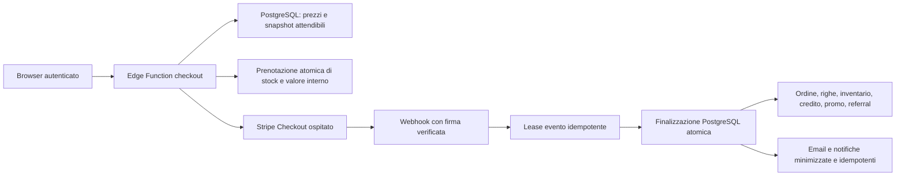

# Audit database, Stripe e pagamenti — 29–30 luglio 2026

## Verdetto esecutivo

Il percorso applicativo e il database dei pagamenti sono stati irrobustiti,
validati da zero in PostgreSQL locale e distribuiti sul progetto Supabase di
produzione `onvufwqybriaoadsdjyk`.

Lo stato verificato al 30 luglio 2026 è:

| Area | Stato | Evidenza principale |
|---|---|---|
| Integrità economica | completata in produzione | vincoli validati e finalizzatori PostgreSQL atomici |
| Concorrenza | completata in produzione | prenotazioni di stock/credito/gift card/promo, row lock e test a due sessioni |
| Autorizzazioni DB/RLS | completata in produzione | RLS su tutte le tabelle pubbliche; nessun `SECURITY DEFINER` pubblico o senza `search_path` controllato |
| Idempotenza webhook | completata in produzione | firma raw-body, registro con lease, retry e finalizzazione idempotente |
| Edge Functions | parzialmente in attesa di configurazione Stripe | webhook e QR first-party aggiornati; release checkout con consenso e blocco alimentare pronta ma non distribuita prima del salvataggio dei Termini |
| Cleanup operativo | completata in produzione | due job `pg_cron` attivi e privilegi client revocati |
| Supply chain | completata | Stripe SDK `20.4.1`, API nel codice `2026-02-25.clover`, `npm audit` senza vulnerabilità note |
| Configurazione Stripe live | completata in produzione | nuovo endpoint, nuovo signing secret, API `2026-02-25.clover` e sei eventi verificati |
| Configurazione Stripe sandbox | completata | endpoint test legacy disabilitato e non eliminato, per rollback |
| Profilo pubblico Stripe | Dashboard-only, da finalizzare | sito, email e Support URL sono corretti; restano nome pubblico, URL privacy/termini, descrittore e riconciliazione degli indirizzi |
| E2E con denaro reale | non eseguita intenzionalmente | nessun addebito o rimborso reale senza autorizzazione esplicita |

L’endpoint webhook live è ora allineato al codice e copre pagamenti completati,
pagamenti asincroni, scadenze, rimborsi e fallimenti. Anche l’endpoint sandbox
legacy è disabilitato. La produzione resta protetta da
`STRIPE_ALLOW_TEST_MODE=false` e non possiede più né il vecchio signing secret
generico né un signing secret test.

## Perimetro e metodo

L’audit ha coperto:

- tutte le migrazioni Supabase/PostgreSQL riproducibili da database vuoto;
- schema remoto, tabelle, vincoli, indici, RLS, grant, funzioni e trigger;
- ordini, righe ordine, carrello, inventario a pezzi/peso, promozioni,
  referral, gift card, credito utente, checkout pendenti e registro webhook;
- Edge Functions per checkout, gift card, completamento, ricevute, email e
  webhook;
- codice browser che calcola e avvia il checkout;
- configurazioni Stripe leggibili in test/live, eventi, versioni API e sessioni;
- dipendenze npm e import Deno;
- comportamento concorrente e percorso funzionale completo del pagamento.

Come richiesto, **non è stato usato Codex Security Report**. Sono stati usati:

1. threat modeling manuale dei confini di fiducia;
2. revisione statica dei percorsi finanziari e delle autorizzazioni;
3. ricostruzione completa del database con tutte le migrazioni;
4. `supabase db lint` locale e remoto;
5. test SQL transazionali di RLS, grant, vincoli e workflow;
6. test concorrenti con due sessioni PostgreSQL reali;
7. test Vitest, test/type-check Deno e `npm audit`;
8. ispezioni live di lock, query, cache, dimensioni e funzioni distribuite;
9. smoke test HTTP sui confini JWT e sulla firma webhook;
10. confronto con la documentazione ufficiale Stripe e Supabase.

Il signing secret Stripe non è stato mostrato né salvato nel repository: la
rotazione è avvenuta in memoria e il valore è stato trasferito direttamente da
Stripe a Supabase. Il controllo successivo ha però individuato un vecchio PAT
Supabase in una configurazione IDE già presente nella cronologia Git pubblica.
Il token storico risponde `403` ed è quindi inattivo; la configurazione corrente
usa `${SUPABASE_ACCESS_TOKEN}`, è limitata al solo progetto e non approva
automaticamente strumenti di scrittura. Il nuovo token locale non è mai entrato
in un commit. Prima delle migrazioni è stato acquisito un dump **solo schema**,
senza dati cliente, con hash SHA-256 conservato nel log operativo della sessione.

## Architettura di fiducia risultante

Principi applicati:

- PostgreSQL è l’autorità per catalogo, prezzi, disponibilità e valore interno.
- Stripe è l’autorità per lo stato del denaro esterno.
- Il browser non è autorità per prezzo, sconto, saldo, stock, identità account,
  URL di ritorno o stato del pagamento.
- Lo snapshot interno deve riconciliarsi al centesimo con
  `Checkout Session.amount_total`.
- Duplicati, retry, eventi fuori ordine e crash non devono duplicare effetti
  economici.

## Correzioni completate

### Database e autorizzazioni

La migrazione `028_payment_database_integrity.sql` e le migrazioni di chiusura
del 30 luglio introducono e verificano:

- vincoli di non negatività e riconciliazione monetaria, ora tutti `VALID`;
- revoca della funzione legacy `use_credits` vulnerabile a importi negativi;
- prenotazione atomica di credito, gift card, limite promo e inventario;
- rilascio idempotente su scadenza/fallimento;
- estensione limitata della prenotazione per pagamenti asincroni;
- finalizzazione atomica di ordine e acquisto gift card;
- decremento/ripristino inventario con ordine di lock stabile;
- conversione e revoca referral verificate;
- rimborso totale idempotente con ripristino stock e valore interno;
- registro webhook con lease, tentativi, errore e retry;
- isolamento utente/admin sulle policy RLS;
- grant minimi per funzioni finanziarie e amministrative;
- revoca esplicita dei grant predefiniti Supabase sulle prove di accettazione,
  sullo storico prezzi e sulla relativa sequenza; il dump remoto conferma i
  soli privilegi selettivi necessari;
- `search_path` esplicito o vuoto sulle funzioni privilegiate;
- output minimo per preview/validazione gift card;
- indici di supporto per ogni foreign key usata;
- rimozione degli indici esattamente duplicati;
- riparazione del drift remoto sulla colonna
  `orders.inventory_decremented`.

Le verifiche finali non rilevano:

- tabelle pubbliche senza RLS;
- funzioni `SECURITY DEFINER` eseguibili da `PUBLIC`;
- funzioni `SECURITY DEFINER` senza `search_path` controllato;
- foreign key prive di indice di supporto;
- coppie di indici strutturalmente duplicate;
- errori o warning nel lint dello schema remoto.

### Cleanup e riconciliazione

`pg_cron` è abilitato e verificato. Sono attivi:

- ogni cinque minuti: rilascio bounded e `SKIP LOCKED` delle prenotazioni
  scadute, con riconciliazione dei checkout pendenti associati;
- ogni giorno: potatura dello storico operativo di `cron.job_run_details`
  oltre quattordici giorni.

Lo schema `cron`, le tabelle di job e le funzioni di schedulazione non sono
utilizzabili dai ruoli `anon` e `authenticated`.

La riconciliazione iniziale riguarda soltanto checkout `created`, non pagati e
più vecchi di 25 ore; esclude esplicitamente record pagati o completati.

### Edge Functions e applicazione

Risultano `ACTIVE` le funzioni di pagamento:

- `create-checkout-session`;
- `create-giftcard-checkout`;
- `stripe-webhook`;
- `generate-giftcard-qr`;
- `complete-order-purchase`;
- `complete-giftcard-purchase`;
- `get-stripe-receipt`;
- `send-order-email`;
- `send-giftcard-email`.

Al 30 luglio il webhook è stato ridistribuito nella versione 62 e la nuova
`generate-giftcard-qr` nella versione 1. Le due funzioni di creazione Checkout
restano attive nella versione precedente: il sorgente aggiornato, già testato,
non viene distribuito finché l’URL dei Termini non è salvato nel profilo Stripe,
perché Stripe rifiuterebbe la creazione di tutte le sessioni che richiedono il
consenso senza quella configurazione.

Le correzioni includono:

- repricing e validazione server-side di catalogo, variante e spedizione;
- email dell’account derivata dal JWT, non dal payload browser;
- allowlist esatta degli URL di ritorno;
- metadati Stripe minimizzati;
- Stripe SDK fissato a `npm:stripe@20.4.1`;
- API nel codice fissata a `2026-02-25.clover`;
- gestione esplicita di `paid`, `unpaid` e `no_payment_required`;
- supporto a completamento/fallimento asincrono, sessione scaduta e rimborso;
- body raw e firma Stripe verificati prima di ogni effetto;
- idempotenza di sessioni, coupon, webhook, fulfillment ed email;
- controllo proprietario sulle ricevute;
- risposta CORS e messaggi d’errore ridotti.

I segreti operativi impostati senza esporne i valori includono:

- `STRIPE_ALLOW_TEST_MODE=false`;
- `STRIPE_ASYNC_RESERVATION_HOURS=168`.

## Audit Stripe

### Elementi solidi

- Stripe Checkout ospitato: il sito non tratta dati carta;
- prezzi e quantità sono ricostruiti da dati server;
- le chiavi segrete restano nelle Edge Functions;
- firma webhook verificata sul body originale;
- sessione riletta da Stripe e riconciliata con lo snapshot DB;
- fulfillment rinviato finché il pagamento non è autorevolmente pagato;
- ordini interamente coperti da valore interno supportano
  `no_payment_required`;
- gift card escluse intenzionalmente dai metodi BNPL;
- l’endpoint webhook non firmato risponde `400`;
- le sette funzioni protette senza JWT rispondono `401`.

### Configurazione provider applicata

Endpoint live autorevole:

- ID `we_1Tz0PfFNqazzxXHEz5BEN6nY`;
- stato `enabled`;
- API `2026-02-25.clover`;
- URL
  `https://onvufwqybriaoadsdjyk.supabase.co/functions/v1/stripe-webhook`;
- eventi:
  - `checkout.session.completed`;
  - `checkout.session.async_payment_succeeded`;
  - `checkout.session.async_payment_failed`;
  - `checkout.session.expired`;
  - `charge.refunded`;
  - `payment_intent.payment_failed`.

Il vecchio endpoint live `we_1Sd87xFNqazzxXHEtmezegws`, con API
`2025-11-17.clover` e l’evento inutilizzato `payment_intent.succeeded`, è stato
disabilitato ma non eliminato. Questo mantiene una possibilità di rollback
esplicita senza produrre doppie consegne.

La rotazione è stata eseguita con la sequenza:

1. creazione idempotente del nuovo endpoint;
2. disabilitazione preventiva;
3. trasferimento diretto del nuovo `whsec_…` a
   `STRIPE_WEBHOOK_SECRET_LIVE`;
4. deploy della Edge Function;
5. verifica crittografica firmata;
6. abilitazione del nuovo endpoint;
7. disabilitazione del vecchio endpoint;
8. rimozione del vecchio `STRIPE_WEBHOOK_SECRET` generico;
9. seconda verifica firmata post-rotazione.

L’endpoint sandbox `we_1SZV6NFNqazzxXHE3MUrzxbn` è stato disabilitato ma non
eliminato. Non può modificare la produzione: il runtime ha
`STRIPE_ALLOW_TEST_MODE=false`, non conserva `STRIPE_WEBHOOK_SECRET_TEST` e
rifiuta eventi non live anche se correttamente firmati.

Il profilo pubblico dell’account è abilitato per addebiti e payout e non presenta
requisiti `currently_due`, `eventually_due` o `past_due`. Sono ora corretti e
verificati:

- sito: `https://www.mimmofratelli.com/`;
- email assistenza: `mimmofratelli1996@gmail.com`;
- Support URL: `https://www.mimmofratelli.com/contacts.html` (verificato `200`).

Restano da finalizzare nel Dashboard:

- nome pubblico/commerciale: `Mimmo Fratelli`;
- Privacy URL: `https://www.mimmofratelli.com/privacy-policy.html`;
- Terms URL: `https://www.mimmofratelli.com/termini-servizio.html`;
- descrittore estratto conto: `MIMMO FRATELLI`;
- descrizione dell’attività e indirizzi, oggi discordanti tra Via Marconi 38,
  Via Luigi Brioschi 9 e Via Enrico Falck 53.

L’identità legale/KYC deve restare il nominativo della persona fisica titolare
della ditta individuale. Il nome commerciale non deve sostituirla nei campi
fiscali o di verifica.

Il recapito telefonico pubblico già presente non deve essere modificato.

La chiave limitata configurata per la CLI permette la lettura dell’account ma,
alla verifica del 30 luglio 2026, non possiede il permesso di scrittura
`Checkout Sessions`: per questo non è stato possibile creare e scadere una
sessione live non pagante che validasse automaticamente l’URL dei Termini.

## Aggiornamento conformità legale e catalogo

Sono state pubblicate e rese raggiungibili senza JavaScript:

- `https://www.mimmofratelli.com/privacy-policy.html`;
- `https://www.mimmofratelli.com/termini-servizio.html`;
- `https://www.mimmofratelli.com/trasparenza-ai.html`.

Le pagine hanno canonical, meta robots `index,follow`, JSON-LD `WebPage`,
collegamenti reciproci e presenza in `sitemap.xml`, `robots.txt` e `llms.txt`.
L’informativa AI distingue correttamente entrata in vigore dell’AI Act,
applicazione generale dal 2 agosto 2026, assenza di decisioni automatizzate e
revisione umana delle bozze CaricoFacile.

Il sorgente Checkout è pronto a richiedere il consenso Stripe ai Termini e il
webhook di produzione è pronto a registrare nel database solo prova minima e
versionata dell’accettazione. L’attivazione lato creazione sessione resta
intenzionalmente vincolata al salvataggio manuale dell’URL dei Termini nel
Dashboard Stripe. Il token QR delle gift card non viene più inviato a un
generatore pubblico: il QR è ora creato in produzione da una Edge Function
autenticata, autorizzata e `no-store`.

Per i sette prodotti preparati o conservati presenti nel catalogo non esiste
una fonte affidabile nel database per ingredienti, allergeni e altre
informazioni obbligatorie. Non sono stati inventati dati: il sistema li marca
come soggetti a informazione alimentare, li mantiene visibili e ne blocca
l’acquisto nell’interfaccia. Anche il blocco nella Edge Function è implementato
e testato, ma diventerà live insieme alla release Checkout successiva al
salvataggio dei Termini. Fino a quel momento la funzione precedente non deve
essere considerata un confine server-side per questo specifico controllo.

## Validazioni eseguite

| Controllo | Esito |
|---|---|
| Ricostruzione completa con `supabase db reset --local` | superata |
| `supabase db lint --local --level warning` | nessun rilievo |
| `supabase db lint --linked --level error` | nessun rilievo dopo hardening ACL |
| Test SQL integrità/RLS/grant/workflow | superati con rollback |
| Concorrenza reale su stesso credito | una sola sessione accettata |
| Concorrenza reale sull’ultimo stock | una sola sessione accettata |
| Smoke workflow nel DB di produzione | superato; dati sintetici annullati nella subtransazione |
| Vincoli economici in produzione | cinque su cinque validati |
| Job cron e launcher | due job attivi; launcher attivo |
| Test applicativi Vitest | 115/115 |
| Test legali/crawler/consenso/QR/informazioni alimentari | 14/14 inclusi nei 115 |
| Test Deno pagamento | 8/8 |
| Type-check Edge Functions | superato |
| `npm audit --omit=dev` | 0 vulnerabilità note |
| Endpoint webhook senza firma | `400` |
| Endpoint webhook con firma non valida | `400 Invalid webhook signature` |
| Firma con il nuovo secret live dopo rimozione del secret legacy | `200`, evento test ignorato intenzionalmente |
| Endpoint live Stripe | nuovo `enabled`, vecchio `disabled` |
| Endpoint sandbox Stripe | legacy `disabled` |
| Secret webhook Supabase | solo `STRIPE_WEBHOOK_SECRET_LIVE` |
| Nuova funzione QR senza JWT | `401` |
| Lock/query lunghe live | nessun blocco applicativo |
| Cache hit tabelle/indici live | 1,00 / 1,00 |
| Dimensione DB live | circa 16 MB |

Non è stato effettuato un addebito reale. Il test funzionale di produzione ha
attraversato prenotazione, finalizzazione, replay idempotente, rimborso e lease
webhook con dati sintetici, poi li ha annullati integralmente.

## Prestazioni

Il database è piccolo e non mostra pressione di capacità. Gli interventi
applicati sono:

- eliminazione degli indici ridondanti coperti da constraint univoci;
- indici mancanti sulle foreign key e sui percorsi caldi;
- lookup indipendenti eseguiti in parallelo nelle funzioni Edge;
- cleanup bounded con `SKIP LOCKED`;
- ordine di acquisizione lock stabile;
- RLS con espressioni di autenticazione cache-friendly;
- lease webhook che evita lavoro duplicato e permette retry sicuro.

Non sono stati eliminati indici in base al solo numero di scan: su un database
piccolo quel dato non dimostra inutilità futura.

## Limiti operativi e rischi residui

- Il profilo pubblico e il descrittore dell’account Stripe Standard richiedono
  una modifica autenticata nel Dashboard; l’API pubblica consente di modificare
  soltanto account connessi.
- Il checkout aggiornato non deve essere distribuito finché l’URL dei Termini
  non è stato salvato in Stripe; fino ad allora il nuovo blocco server-side
  degli alimenti non verificati non è ancora attivo, mentre il blocco UI è live.
- Non esiste un progetto Supabase di staging separato. Crearlo può generare
  costi e richiede una decisione dell’account.
- Le API del progetto non espongono backup recenti né PITR attivo. L’attivazione
  dipende dal piano Supabase; il dump solo schema non sostituisce un backup dati.
- I rimborsi parziali restano manuali: serve una policy per allocare il rimborso
  tra denaro Stripe, credito, gift card, spedizione e righe.
- Se valore convertito in credito è già stato speso, una revoca può richiedere
  saldo negativo o revisione manuale.
- Per prodotti deperibili è preferibile non abilitare metodi a notifica
  ritardata, oppure concordare una finestra di prenotazione stock coerente.
- Il codice è limitato a EUR e spedizione italiana; nuovi paesi o valute
  richiedono modellazione fiscale e operativa dedicata.
- Le migrazioni finanziarie vanno corrette in avanti; un rollback cieco dopo
  nuove transazioni non è sicuro.

## File di controllo principali

- `supabase/migrations/028_payment_database_integrity.sql`
- `supabase/migrations/20260730191710_validate_payment_constraints.sql`
- `supabase/migrations/20260730192045_repair_orders_inventory_flag.sql`
- `supabase/migrations/20260730192921_enable_checkout_reservation_cleanup.sql`
- `supabase/migrations/20260730193052_validate_checkout_reservation_cleanup.sql`
- `supabase/migrations/20260730193209_verify_production_payment_workflow.sql`
- `supabase/migrations/20260730193446_reconcile_stale_pending_checkouts.sql`
- `supabase/migrations/20260730210000_checkout_legal_acceptances.sql`
- `supabase/migrations/20260731000000_omnibus_food_info_compliance.sql`
- `supabase/migrations/20260731003000_tighten_legal_and_price_history_privileges.sql`
- `supabase/tests/payment_database_integrity_test.sql`
- `scripts/test-payment-concurrency.sh`
- `supabase/functions/_shared/payment.ts`
- `supabase/functions/_shared/fulfillment.ts`
- `supabase/functions/_shared/email.ts`
- le nove Edge Functions elencate sopra.

## Riferimenti ufficiali

- Stripe, checklist go-live:
  https://docs.stripe.com/get-started/checklist/go-live
- Stripe, fulfillment Checkout:
  https://docs.stripe.com/checkout/fulfillment
- Stripe, firma e gestione webhook:
  https://docs.stripe.com/webhooks/signature?lang=node
- Stripe, versionamento API:
  https://docs.stripe.com/api/versioning
- Supabase, gestione ambienti:
  https://supabase.com/docs/guides/deployment/managing-environments
- Supabase, deploy Edge Functions:
  https://supabase.com/docs/guides/functions/deploy
- Supabase, checklist produzione:
  https://supabase.com/docs/guides/deployment/going-into-prod
- Supabase, backup:
  https://supabase.com/docs/guides/platform/backups
- Supabase, Cron:
  https://supabase.com/docs/guides/cron
- Supabase, Row Level Security:
  https://supabase.com/docs/guides/database/postgres/row-level-security
