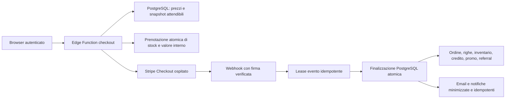

# Audit database, Stripe e pagamenti — 29–30 luglio 2026

## Verdetto esecutivo

Il percorso applicativo e il database dei pagamenti sono stati irrobustiti,
validati da zero in PostgreSQL locale e distribuiti sul progetto Supabase di
produzione `onvufwqybriaoadsdjyk`.

Lo stato verificato al 30 luglio 2026 è:

| Area | Stato | Evidenza principale |
|---|---|---|
| Integrità economica | completata in produzione | vincoli validati e finalizzatori PostgreSQL atomici |
| Concorrenza | completata in produzione | prenotazioni di stock/credito/gift card/promo, row lock e test a due sessioni |
| Autorizzazioni DB/RLS | completata in produzione | RLS su tutte le tabelle pubbliche; nessun `SECURITY DEFINER` pubblico o senza `search_path` controllato |
| Idempotenza webhook | completata nel codice e nel DB | firma raw-body, registro con lease, retry e finalizzazione idempotente |
| Edge Functions | completata in produzione | otto funzioni distribuite e attive |
| Cleanup operativo | completata in produzione | due job `pg_cron` attivi e privilegi client revocati |
| Supply chain | completata | Stripe SDK `20.4.1`, API nel codice `2026-02-25.clover`, `npm audit` senza vulnerabilità note |
| Configurazione Dashboard Stripe | **bloccata da autenticazione provider** | chiave CLI di sola lettura; nessuna modifica parziale eseguita |
| E2E con denaro reale | non eseguita intenzionalmente | nessun addebito o rimborso reale senza autorizzazione esplicita |

La parte ancora aperta non è nel codice né nel database: gli endpoint webhook
Stripe test/live devono essere riallineati dal Dashboard autenticato. La
produzione resta protetta da `STRIPE_ALLOW_TEST_MODE=false`, ma la copertura
completa degli eventi asincroni, delle scadenze e dei rimborsi richiede la
modifica provider descritta più avanti.

## Perimetro e metodo

L’audit ha coperto:

- tutte le migrazioni Supabase/PostgreSQL riproducibili da database vuoto;
- schema remoto, tabelle, vincoli, indici, RLS, grant, funzioni e trigger;
- ordini, righe ordine, carrello, inventario a pezzi/peso, promozioni,
  referral, gift card, credito utente, checkout pendenti e registro webhook;
- Edge Functions per checkout, gift card, completamento, ricevute, email e
  webhook;
- codice browser che calcola e avvia il checkout;
- configurazioni Stripe leggibili in test/live, eventi, versioni API e sessioni;
- dipendenze npm e import Deno;
- comportamento concorrente e percorso funzionale completo del pagamento.

Come richiesto, **non è stato usato Codex Security Report**. Sono stati usati:

1. threat modeling manuale dei confini di fiducia;
2. revisione statica dei percorsi finanziari e delle autorizzazioni;
3. ricostruzione completa del database con tutte le migrazioni;
4. `supabase db lint` locale e remoto;
5. test SQL transazionali di RLS, grant, vincoli e workflow;
6. test concorrenti con due sessioni PostgreSQL reali;
7. test Vitest, test/type-check Deno e `npm audit`;
8. ispezioni live di lock, query, cache, dimensioni e funzioni distribuite;
9. smoke test HTTP sui confini JWT e sulla firma webhook;
10. confronto con la documentazione ufficiale Stripe e Supabase.

Non sono stati letti, copiati o registrati valori di segreti. Prima delle
migrazioni è stato acquisito un dump **solo schema**, senza dati cliente, con
hash SHA-256 conservato nel log operativo della sessione.

## Architettura di fiducia risultante

Principi applicati:

- PostgreSQL è l’autorità per catalogo, prezzi, disponibilità e valore interno.
- Stripe è l’autorità per lo stato del denaro esterno.
- Il browser non è autorità per prezzo, sconto, saldo, stock, identità account,
  URL di ritorno o stato del pagamento.
- Lo snapshot interno deve riconciliarsi al centesimo con
  `Checkout Session.amount_total`.
- Duplicati, retry, eventi fuori ordine e crash non devono duplicare effetti
  economici.

## Correzioni completate

### Database e autorizzazioni

La migrazione `028_payment_database_integrity.sql` e le migrazioni di chiusura
del 30 luglio introducono e verificano:

- vincoli di non negatività e riconciliazione monetaria, ora tutti `VALID`;
- revoca della funzione legacy `use_credits` vulnerabile a importi negativi;
- prenotazione atomica di credito, gift card, limite promo e inventario;
- rilascio idempotente su scadenza/fallimento;
- estensione limitata della prenotazione per pagamenti asincroni;
- finalizzazione atomica di ordine e acquisto gift card;
- decremento/ripristino inventario con ordine di lock stabile;
- conversione e revoca referral verificate;
- rimborso totale idempotente con ripristino stock e valore interno;
- registro webhook con lease, tentativi, errore e retry;
- isolamento utente/admin sulle policy RLS;
- grant minimi per funzioni finanziarie e amministrative;
- `search_path` esplicito o vuoto sulle funzioni privilegiate;
- output minimo per preview/validazione gift card;
- indici di supporto per ogni foreign key usata;
- rimozione degli indici esattamente duplicati;
- riparazione del drift remoto sulla colonna
  `orders.inventory_decremented`.

Le verifiche finali non rilevano:

- tabelle pubbliche senza RLS;
- funzioni `SECURITY DEFINER` eseguibili da `PUBLIC`;
- funzioni `SECURITY DEFINER` senza `search_path` controllato;
- foreign key prive di indice di supporto;
- coppie di indici strutturalmente duplicate;
- errori o warning nel lint dello schema remoto.

### Cleanup e riconciliazione

`pg_cron` è abilitato e verificato. Sono attivi:

- ogni cinque minuti: rilascio bounded e `SKIP LOCKED` delle prenotazioni
  scadute, con riconciliazione dei checkout pendenti associati;
- ogni giorno: potatura dello storico operativo di `cron.job_run_details`
  oltre quattordici giorni.

Lo schema `cron`, le tabelle di job e le funzioni di schedulazione non sono
utilizzabili dai ruoli `anon` e `authenticated`.

La riconciliazione iniziale riguarda soltanto checkout `created`, non pagati e
più vecchi di 25 ore; esclude esplicitamente record pagati o completati.

### Edge Functions e applicazione

Sono state distribuite e risultano `ACTIVE`:

- `create-checkout-session`;
- `create-giftcard-checkout`;
- `stripe-webhook`;
- `complete-order-purchase`;
- `complete-giftcard-purchase`;
- `get-stripe-receipt`;
- `send-order-email`;
- `send-giftcard-email`.

Le correzioni includono:

- repricing e validazione server-side di catalogo, variante e spedizione;
- email dell’account derivata dal JWT, non dal payload browser;
- allowlist esatta degli URL di ritorno;
- metadati Stripe minimizzati;
- Stripe SDK fissato a `npm:stripe@20.4.1`;
- API nel codice fissata a `2026-02-25.clover`;
- gestione esplicita di `paid`, `unpaid` e `no_payment_required`;
- supporto a completamento/fallimento asincrono, sessione scaduta e rimborso;
- body raw e firma Stripe verificati prima di ogni effetto;
- idempotenza di sessioni, coupon, webhook, fulfillment ed email;
- controllo proprietario sulle ricevute;
- risposta CORS e messaggi d’errore ridotti.

I segreti operativi impostati senza esporne i valori includono:

- `STRIPE_ALLOW_TEST_MODE=false`;
- `STRIPE_ASYNC_RESERVATION_HOURS=168`.

## Audit Stripe

### Elementi solidi

- Stripe Checkout ospitato: il sito non tratta dati carta;
- prezzi e quantità sono ricostruiti da dati server;
- le chiavi segrete restano nelle Edge Functions;
- firma webhook verificata sul body originale;
- sessione riletta da Stripe e riconciliata con lo snapshot DB;
- fulfillment rinviato finché il pagamento non è autorevolmente pagato;
- ordini interamente coperti da valore interno supportano
  `no_payment_required`;
- gift card escluse intenzionalmente dai metodi BNPL;
- l’endpoint webhook non firmato risponde `400`;
- le sette funzioni protette senza JWT rispondono `401`.

### Configurazione provider ancora da applicare

Endpoint osservati in sola lettura:

- test `we_1SZV6NFNqazzxXHE3MUrzxbn`;
- live `we_1Sd87xFNqazzxXHEtmezegws`.

Entrambi puntano alla funzione di produzione e usano ancora la versione
`2025-11-17.clover`. La sottoscrizione test contiene soltanto
`checkout.session.completed`; quella live contiene anche
`payment_intent.succeeded` e `payment_intent.payment_failed`.

Configurazione target:

1. creare un nuovo endpoint live con un nuovo signing secret;
2. salvare il nuovo secret in Supabase senza stamparlo;
3. sottoscrivere:
   - `checkout.session.completed`;
   - `checkout.session.async_payment_succeeded`;
   - `checkout.session.async_payment_failed`;
   - `checkout.session.expired`;
   - `charge.refunded`;
   - `payment_intent.payment_failed`;
4. rimuovere `payment_intent.succeeded`, non usato dal fulfillment;
5. impostare l’endpoint su `2026-02-25.clover`;
6. eseguire un evento firmato di prova;
7. disabilitare, senza eliminare immediatamente, i vecchi endpoint;
8. destinare gli eventi test esclusivamente a uno staging isolato.

La chiave Stripe disponibile alla CLI è ristretta e non autorizza
creazione/aggiornamento degli endpoint. Il browser disponibile non era
autenticato al Dashboard: per evitare configurazioni parziali non è stato
modificato alcun endpoint né ruotato alcun signing secret.

Support URL, branding e prefisso descrittore restano attività operative da
completare con i dati legali/commerciali definitivi.

## Validazioni eseguite

| Controllo | Esito |
|---|---|
| Ricostruzione completa con `supabase db reset --local` | superata |
| `supabase db lint --local --level warning` | nessun rilievo |
| `supabase db lint --linked --level warning` | nessun rilievo dopo riparazione drift |
| Test SQL integrità/RLS/grant/workflow | superati con rollback |
| Concorrenza reale su stesso credito | una sola sessione accettata |
| Concorrenza reale sull’ultimo stock | una sola sessione accettata |
| Smoke workflow nel DB di produzione | superato; dati sintetici annullati nella subtransazione |
| Vincoli economici in produzione | cinque su cinque validati |
| Job cron e launcher | due job attivi; launcher attivo |
| Test applicativi Vitest | 101/101 |
| Test Deno pagamento | 8/8 |
| Type-check Edge Functions | superato |
| `npm audit --omit=dev` | 0 vulnerabilità note |
| Endpoint webhook senza firma | `400` |
| Funzioni protette senza JWT | sette su sette `401` |
| Lock/query lunghe live | nessun blocco applicativo |
| Cache hit tabelle/indici live | 1,00 / 1,00 |
| Dimensione DB live | circa 16 MB |

Non è stato effettuato un addebito reale. Il test funzionale di produzione ha
attraversato prenotazione, finalizzazione, replay idempotente, rimborso e lease
webhook con dati sintetici, poi li ha annullati integralmente.

## Prestazioni

Il database è piccolo e non mostra pressione di capacità. Gli interventi
applicati sono:

- eliminazione degli indici ridondanti coperti da constraint univoci;
- indici mancanti sulle foreign key e sui percorsi caldi;
- lookup indipendenti eseguiti in parallelo nelle funzioni Edge;
- cleanup bounded con `SKIP LOCKED`;
- ordine di acquisizione lock stabile;
- RLS con espressioni di autenticazione cache-friendly;
- lease webhook che evita lavoro duplicato e permette retry sicuro.

Non sono stati eliminati indici in base al solo numero di scan: su un database
piccolo quel dato non dimostra inutilità futura.

## Limiti operativi e rischi residui

- Non esiste un progetto Supabase di staging separato. Crearlo può generare
  costi e richiede una decisione dell’account.
- Le API del progetto non espongono backup recenti né PITR attivo. L’attivazione
  dipende dal piano Supabase; il dump solo schema non sostituisce un backup dati.
- I rimborsi parziali restano manuali: serve una policy per allocare il rimborso
  tra denaro Stripe, credito, gift card, spedizione e righe.
- Se valore convertito in credito è già stato speso, una revoca può richiedere
  saldo negativo o revisione manuale.
- Per prodotti deperibili è preferibile non abilitare metodi a notifica
  ritardata, oppure concordare una finestra di prenotazione stock coerente.
- Il codice è limitato a EUR e spedizione italiana; nuovi paesi o valute
  richiedono modellazione fiscale e operativa dedicata.
- Le migrazioni finanziarie vanno corrette in avanti; un rollback cieco dopo
  nuove transazioni non è sicuro.

## File di controllo principali

- `supabase/migrations/028_payment_database_integrity.sql`
- `supabase/migrations/20260730191710_validate_payment_constraints.sql`
- `supabase/migrations/20260730192045_repair_orders_inventory_flag.sql`
- `supabase/migrations/20260730192921_enable_checkout_reservation_cleanup.sql`
- `supabase/migrations/20260730193052_validate_checkout_reservation_cleanup.sql`
- `supabase/migrations/20260730193209_verify_production_payment_workflow.sql`
- `supabase/migrations/20260730193446_reconcile_stale_pending_checkouts.sql`
- `supabase/tests/payment_database_integrity_test.sql`
- `scripts/test-payment-concurrency.sh`
- `supabase/functions/_shared/payment.ts`
- `supabase/functions/_shared/fulfillment.ts`
- `supabase/functions/_shared/email.ts`
- le otto Edge Functions elencate sopra.

## Riferimenti ufficiali

- Stripe, checklist go-live:
  https://docs.stripe.com/get-started/checklist/go-live
- Stripe, fulfillment Checkout:
  https://docs.stripe.com/checkout/fulfillment
- Stripe, firma e gestione webhook:
  https://docs.stripe.com/webhooks/signature?lang=node
- Stripe, versionamento API:
  https://docs.stripe.com/api/versioning
- Supabase, gestione ambienti:
  https://supabase.com/docs/guides/deployment/managing-environments
- Supabase, deploy Edge Functions:
  https://supabase.com/docs/guides/functions/deploy
- Supabase, checklist produzione:
  https://supabase.com/docs/guides/deployment/going-into-prod
- Supabase, backup:
  https://supabase.com/docs/guides/platform/backups
- Supabase, Cron:
  https://supabase.com/docs/guides/cron
- Supabase, Row Level Security:
  https://supabase.com/docs/guides/database/postgres/row-level-security
